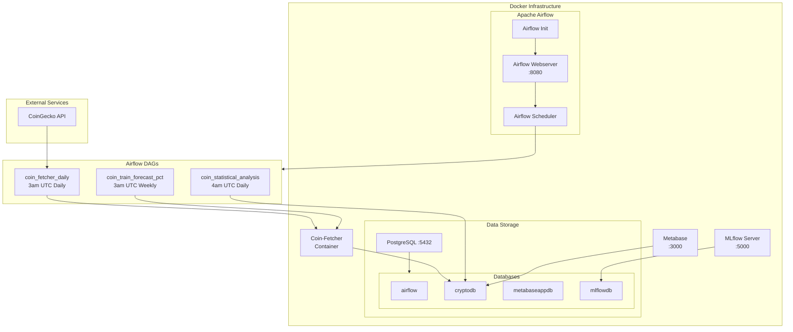
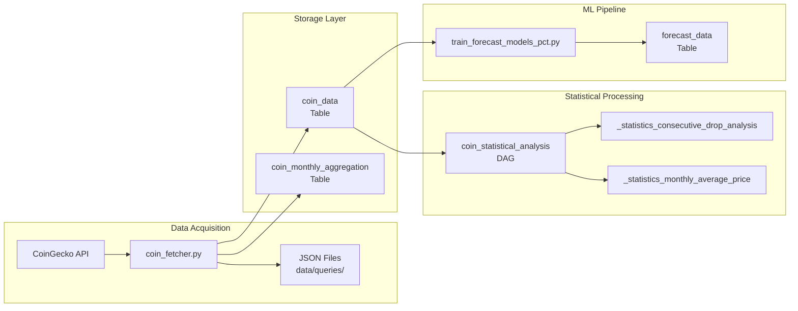
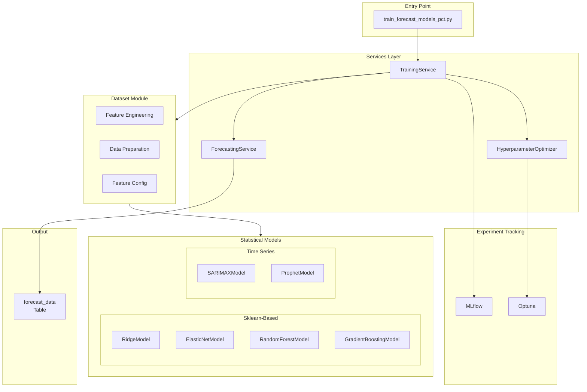
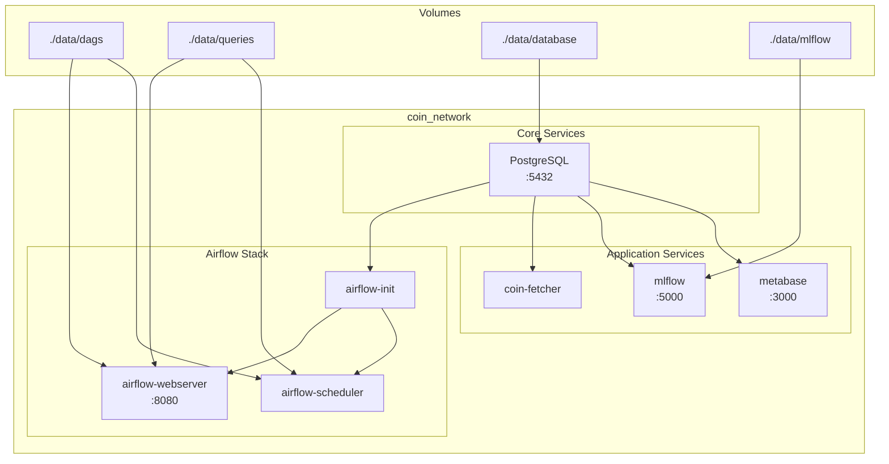
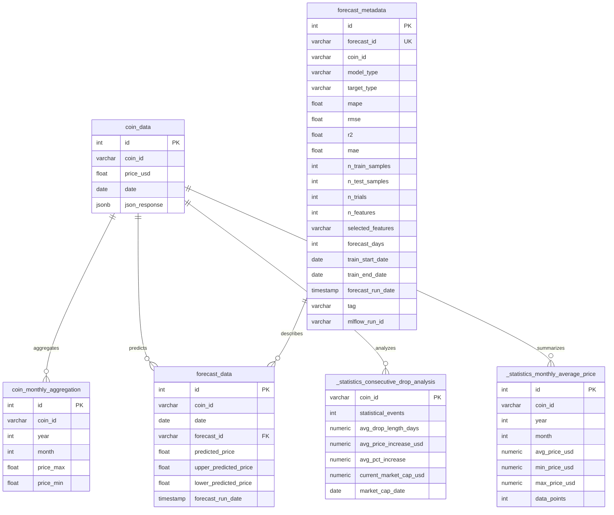
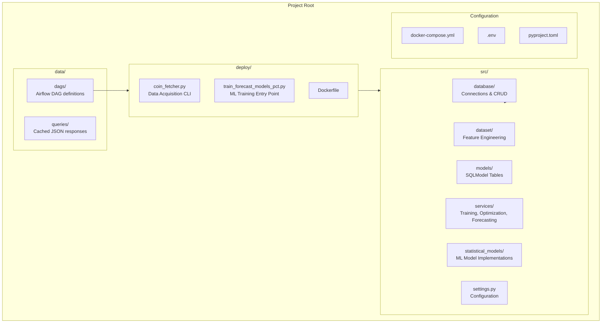
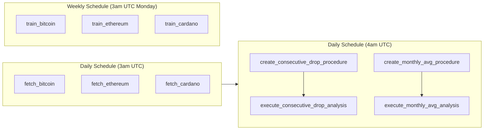

# Project Architecture Diagram

## High-Level Architecture

## Data Pipeline Flow

## ML Training Architecture

## Docker Services Interaction

## Database Schema

## Project Structure

## Airflow DAG Dependencies

## Technology Stack

| Component | Technology | Purpose |
|-----------|------------|---------|
| Orchestration | Apache Airflow 2.8.1 | DAG scheduling and execution |
| Database | PostgreSQL 17 | Data persistence |
| ML Tracking | MLflow | Experiment tracking |
| Optimization | Optuna | Hyperparameter tuning |
| Visualization | Metabase | Business intelligence |
| Containerization | Docker Compose | Service orchestration |
| Package Manager | UV | Python dependency management |
| ML Models | scikit-learn, statsmodels, Prophet | Prediction models |
