# Diagrama de Arquitectura — Débitos Recurrentes (Bancolombia)

## Arquitectura General

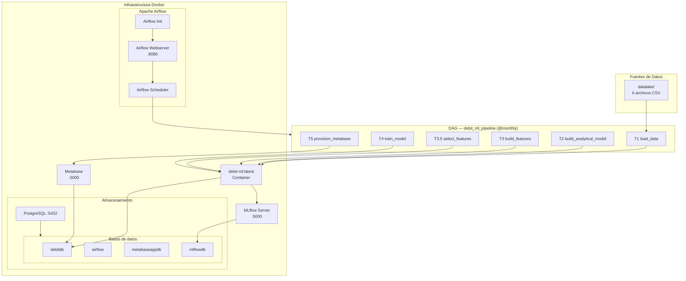

## Flujo del Pipeline de Datos

```mermaid
flowchart LR
    subgraph Ingest["Ingesta de Datos"]
        CSV1["clientes_seleccionados.csv"]
        CSV2["canales_prueba_tecnica.csv"]
        CSV3["excedente.csv"]
        CSV4["gestiones.csv"]
        CSV5["moras.csv"]
        CSV6["tanque.csv (pagos)"]
        Loader["loader.py<br/>streaming 2-pasadas"]
    end

    subgraph DBTables["debitdb — Tablas"]
        TClient["debit_client"]
        TPago["debit_pago"]
        TGestion["debit_gestion"]
        TMora["debit_mora"]
        TExcedente["debit_excedente"]
        TCanal["debit_canal"]
    end

    subgraph Preparation["Preparación Analítica"]
        DataPrep["data_preparation.py<br/>build_analytical_model()"]
        AnalyticalModel["analytical_model.parquet"]
    end

    subgraph Features["Feature Engineering"]
        FeatEng["feature_engineering.py<br/>build_debit_features()"]
        TrainParq["train.parquet<br/>(22,291 filas)"]
        TestParq["test.parquet<br/>(13,712 filas)"]
        OOTParq["oot.parquet<br/>(10,733 filas)"]
    end

    subgraph Selection["Selección de Features"]
        FeatSel["feature_selection.py<br/>varianza → ANOVA → ElasticNet"]
        FeatCols["feature_cols.json<br/>(60 features — Opción A)"]
    end

    subgraph Training["Entrenamiento ML"]
        TrainScript["train_debit_classifier.py"]
        MLflowRuns["MLflow Runs<br/>(debit-models)"]
        PKL["model_*.pkl<br/>data/artifacts/"]
    end

    subgraph Export["Exportación Métricas"]
        ExportMetrics["export_model_metrics.py"]
        ExportSHAP["export_shap_features.py<br/>(TreeExplainer XGB/GBM + LinearExplainer LR)"]
        ExportPipeline["export_pipeline_metrics.py<br/>(103 métricas — 4 etapas)"]
        ModelMetrics["debit_model_metrics"]
        ModelFeatures["debit_model_features<br/>(50 features × 3 modelos × N configs)"]
        PipelineMetrics["debit_pipeline_metrics"]
    end

    subgraph Viz["Visualización"]
        Views["v_debit_* views<br/>(9 vistas SQL)"]
        Dashboard["Metabase Dashboard<br/>id=4, :3000"]
    end

    CSV1 --> Loader
    CSV2 --> Loader
    CSV3 --> Loader
    CSV4 --> Loader
    CSV5 --> Loader
    CSV6 --> Loader
    Loader --> TClient
    Loader --> TPago
    Loader --> TGestion
    Loader --> TMora
    Loader --> TExcedente
    Loader --> TCanal

    TClient --> DataPrep
    TPago --> DataPrep
    TGestion --> DataPrep
    TMora --> DataPrep
    TExcedente --> DataPrep
    TCanal --> DataPrep
    DataPrep --> AnalyticalModel

    AnalyticalModel --> FeatEng
    FeatEng --> TrainParq
    FeatEng --> TestParq
    FeatEng --> OOTParq

    TrainParq --> FeatSel
    FeatSel --> FeatCols

    TrainParq --> TrainScript
    TestParq --> TrainScript
    OOTParq --> TrainScript
    FeatCols --> TrainScript
    TrainScript --> MLflowRuns
    TrainScript --> PKL

    MLflowRuns --> ExportMetrics
    PKL --> ExportSHAP
    ExportMetrics --> ModelMetrics
    ExportMetrics --> ModelFeatures
    ExportSHAP --> ModelFeatures
    FeatSel --> ExportPipeline
    AnalyticalModel --> ExportPipeline
    ExportPipeline --> PipelineMetrics

    TClient --> Views
    TPago --> Views
    ModelMetrics --> Dashboard
    ModelFeatures --> Dashboard
    PipelineMetrics --> Dashboard
    Views --> Dashboard
```

## Arquitectura de Entrenamiento ML

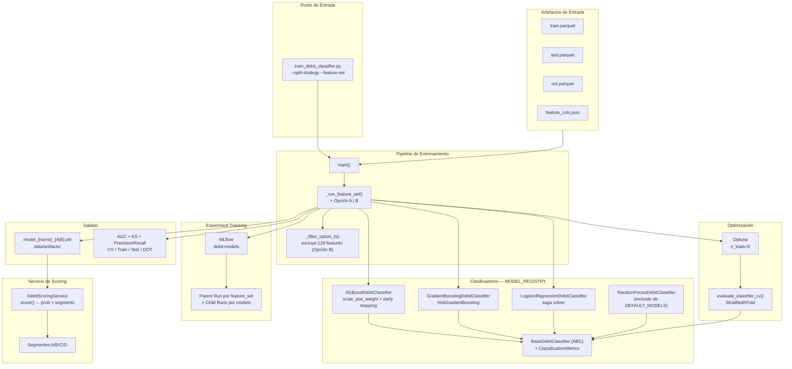

## Interacción de Servicios Docker

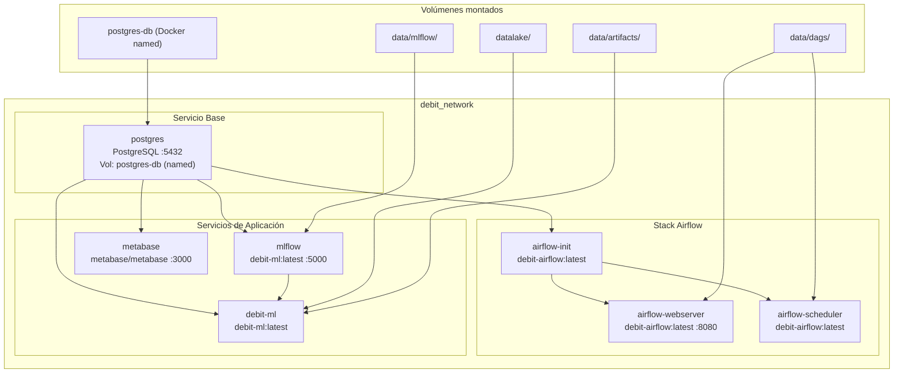

## Esquema de Base de Datos

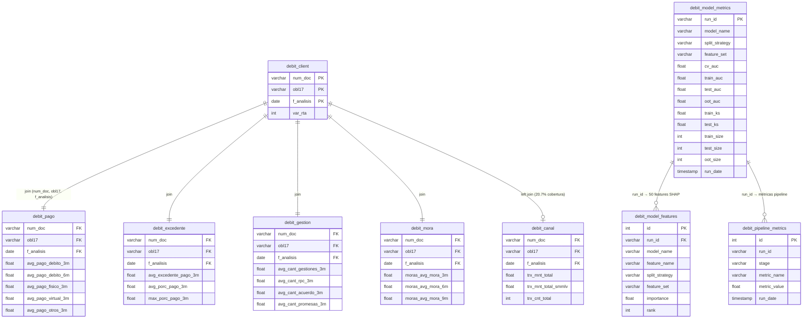

## Estructura del Proyecto

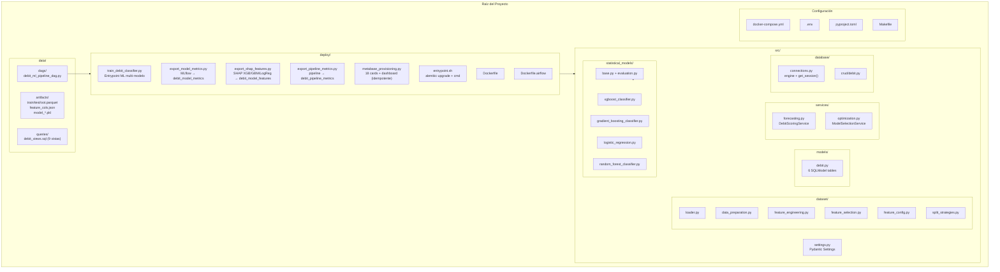

## Dependencias del DAG — debit_ml_pipeline

```mermaid
flowchart LR
    subgraph Gates["ShortCircuitOperators (gates)"]
        G0["gate_setup<br/>RUN_SETUP"]
        G1["gate_load_data<br/>RUN_LOAD_DATA"]
        G2["gate_build_model<br/>RUN_BUILD_MODEL"]
        G3["gate_build_features<br/>RUN_BUILD_FEATURES"]
        G35["gate_select_features<br/>RUN_SELECT_FEATURES"]
        G4["gate_train<br/>RUN_TRAIN"]
        G5["gate_metabase<br/>RUN_METABASE"]
    end

    subgraph Tasks["DockerOperator Tasks (debit-ml:latest)"]
        T0["T0 setup_artifacts_dir<br/>mkdir /app/data/artifacts"]
        T1["T1 load_data<br/>src.dataset.loader"]
        T2["T2 build_analytical_model<br/>src.dataset.data_preparation"]
        T3["T3 build_features<br/>src.dataset.feature_engineering"]
        T35["T3.5 select_features<br/>src.dataset.feature_selection"]
        T4["T4 train_model<br/>deploy.train_debit_classifier"]
        T5["T5 provision_metabase<br/>deploy.metabase_provisioning"]
    end

    G0 --> T0
    T0 --> G1
    G1 --> T1
    T1 --> G2
    G2 --> T2
    T2 --> G3
    G3 --> T3
    T3 --> G35
    G35 --> T35
    T35 --> G4
    G4 --> T4
    T4 --> G5
    G5 --> T5
```

## Segmentación de Cobranza

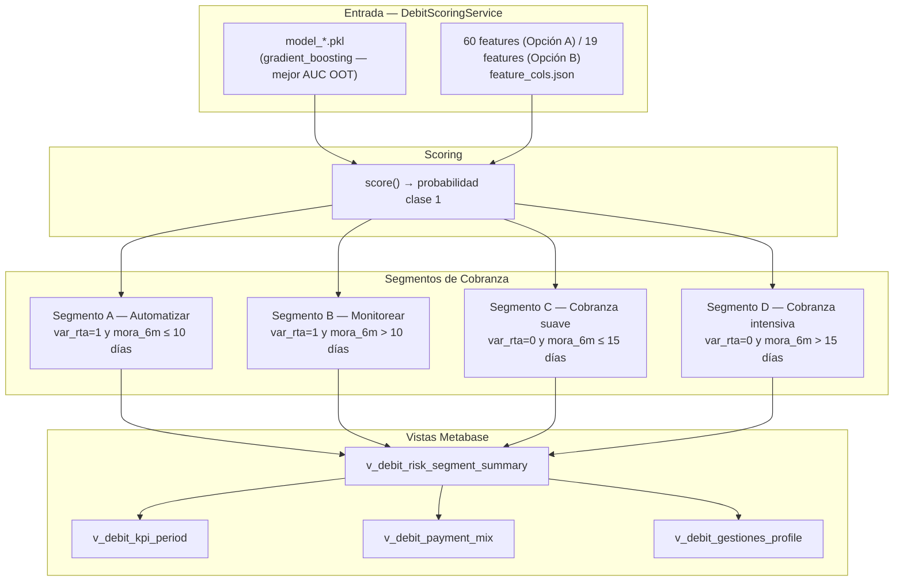

## Stack Tecnológico

| Componente | Tecnología | Propósito |
|------------|------------|-----------|
| Orquestación | Apache Airflow 2.8.1 | Scheduling y ejecución del DAG |
| Base de datos | PostgreSQL 17 | Persistencia de datos y vistas Metabase |
| ML Tracking | MLflow | Registro de experimentos y artefactos |
| Optimización | Optuna | Hyperparameter tuning (n_trials=5) |
| Visualización | Metabase | Dashboard de cobranza (18 cards) |
| Contenedores | Docker Compose | Orquestación de servicios |
| Gestor de paquetes | UV | Gestión de dependencias Python |
| Modelos ML | XGBoost, HistGBM, LogisticRegression | Clasificación binaria var_rta |
| Interpretabilidad | SHAP (TreeExplainer + LinearExplainer) | Feature importance para XGBoost, HistGBM y LogisticRegression |
| ORM | SQLModel + SQLAlchemy | Modelos de datos y migraciones |
| Migraciones | Alembic | Schema versioning — 5 migraciones aplicadas |
| Parametrización | `split_strategy` × `feature_set` | 4 configuraciones: A/B × random/temporal |

---

## Hallazgos Críticos del EDA

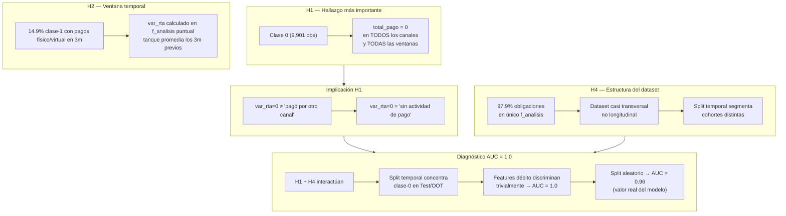

---

## Resultados del Modelo — Métricas Clave

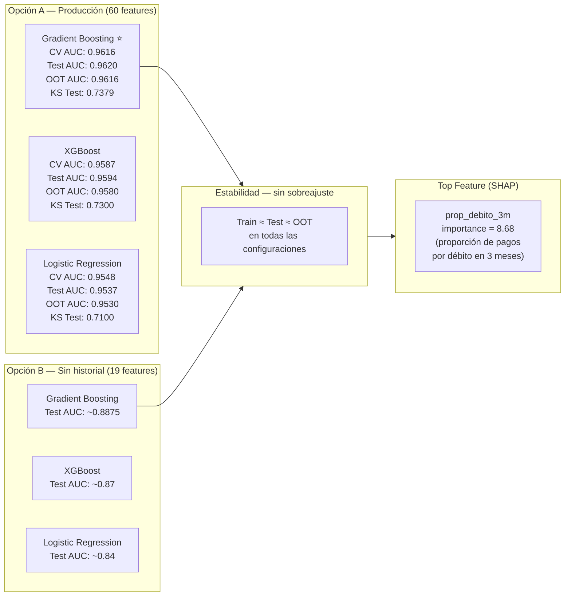

---

## Flujo de Valor — Impacto en Cobranza

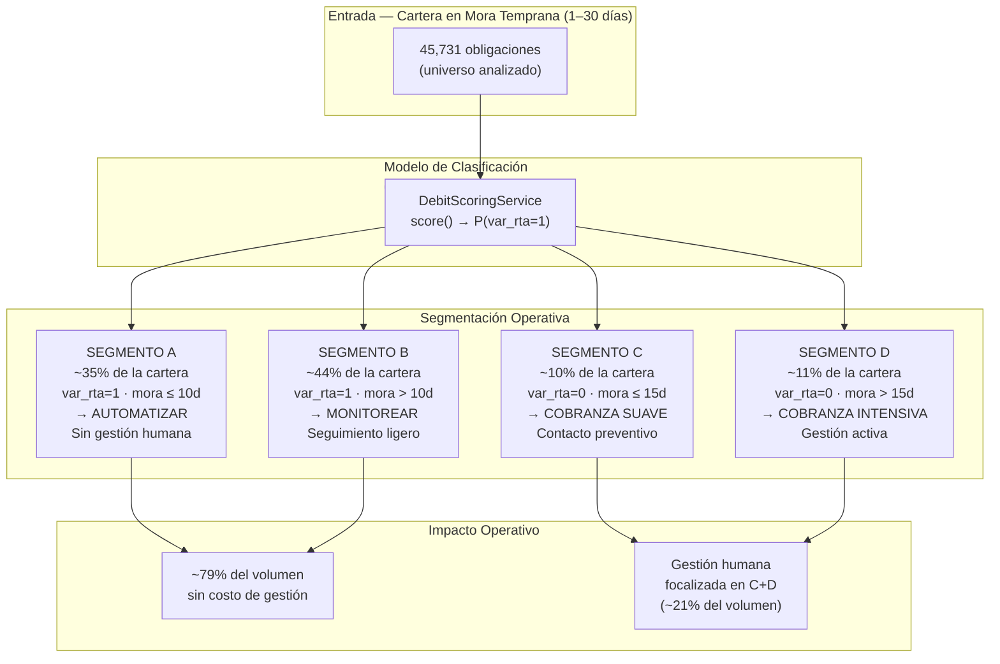

---

## Conclusiones y Accionables de Negocio

```mermaid
flowchart TB
    subgraph Findings["Conclusiones Técnicas"]
        F1["✅ Modelo válido y robusto\nAUC=0.96 · KS=0.74\nTrain≈Test≈OOT"]
        F2["✅ H1 — hallazgo crítico\nClase-0 = sin actividad de pago\nRedefine objetivo del modelo"]
        F3["✅ Selección supervisada confirma EDA\npago_fisico y pago_otros\neliminados automáticamente por ANOVA"]
        F4["✅ Diagnóstico transparente\nAUC=1.0 temporal = causa estructural\nno sobreajuste ni leakage"]
        F5["✅ Opción B agrega valor\nAUC=0.88 solo con gestiones+moras\nComportamiento de cobranza predice el pago"]
    end

    subgraph Actions["Accionables Inmediatos"]
        A1["🔴 Alta prioridad\nActivar Segmento A\nDesactivar gestión humana"]
        A2["🔴 Alta prioridad\nAjustar umbral operativo\nsegún costo-beneficio real"]
        A3["🟡 Media prioridad\nDesplegar Opción B\npara clientes sin historial"]
        A4["🟡 Media prioridad\nMonitoreo automático\nPSI mensual sobre prop_debito_3m"]
        A5["🟢 Normal\nRe-entrenamiento automático\nsi AUC OOT < 0.90"]
    end

    subgraph Requirements["Requerimientos Cumplidos"]
        R1["R1 ✅ Modelo de datos analítico\n(num_doc, obl17, f_analisis)"]
        R2["R2 ✅ Pipeline escalable\nAirflow DAG @monthly"]
        R3["R3 ✅ Split Train/Test/OOT\nJustificado + diagnóstico resuelto"]
        R4["R4 ✅ AUC=0.96 + KS + P/R/F1\n+ Brier + Calibración + SHAP"]
        R5["R5 ✅ Dashboard Metabase\n18 cards · accionables de negocio"]
    end

    Findings --> Actions
    Actions --> Requirements
```
